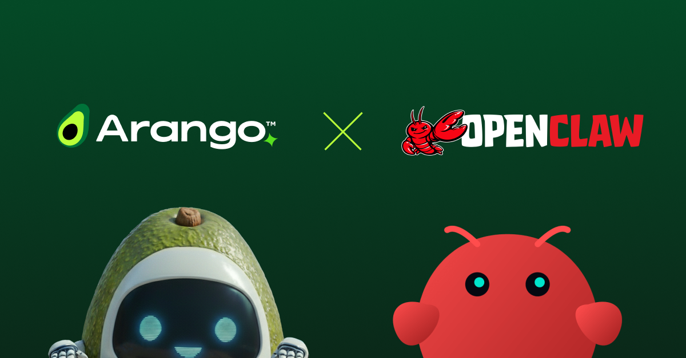

# The Missing Layer in OpenClaw Agent Architectures: Contextual Data

Replacing flat memory with a unified multi-model foundation



ArangoDB serves as an upgrade to the memory layer of [OpenClaw](https://github.com/openclaw) agents—introducing a unified system that combines graph, vector, and document data, replacing fragmented approaches like SQLite and flat Markdown with a scalable, context-rich architecture.

Arango enhances the native OpenClaw interface with `memory_store`, `memory_search`, `memory_get`, and `memory_delete`, while adding capabilities not available out of the box: a typed entity knowledge graph, multi-hop (BFS) graph traversal, session-linked conversation history, and optimized retrieval performance through features like in-memory index loading—enabling faster, context-aware agent reasoning at scale.

---

## OpenClaw's Default Memory

OpenClaw ships with a simple, file-oriented memory system:

- **`MEMORY.md` / `memory/YYYY-MM-DD.md`** — flat Markdown files for persistent context
- **SQLite** with FTS5 for keyword search and `sqlite-vec` for semantic/vector search
- **Optional QMD sidecar** for GGUF embeddings

This works for basic recall, but it’s fundamentally a flat system. Memories are rows in a table. There’s no native way to express relationships you’ll need as data becomes richer—like linking people, organizations, and communications (e.g., who leads a company, who emailed whom), or capturing context such as “this memory was part of session X” or “these 50 memories were compacted into a daily summary.” Relationships have to live in the application layer—stitched together in Python, not in the data.

This limitation becomes clear when working with real-world datasets like the Enron Email Corpus—one of the most widely used public enterprise email datasets. Released by the Federal Energy Regulatory Commission during its investigation into the collapse of Enron, the dataset contains roughly 500,000 emails from about 150 employees, many of them senior executives. It’s become a standard benchmark for AI and NLP research, used in areas like email classification, social network analysis, and link analysis.

But modeling this kind of data in a flat system quickly breaks down. You’re not just storing emails—you’re trying to understand relationships: who communicated with whom, how influence flows across an organization, how conversations evolve over time. Without a native way to represent and traverse those connections, the burden shifts to the application layer—adding complexity, fragility, and limiting what AI systems can actually reason about.

---

## Why Arango — The Contextual Data Layer for Agentic AI

### Agent memory requires a unified multi-model foundation

Agent memory isn’t just text — it spans multiple data representations that must work together:

**Documents** — facts, notes, decisions, and preferences with rich metadata (type, tags, confidence, timestamps, TTL)
**Vectors** — embeddings for semantic search (e.g., “find memories about accounting fraud”)
**Graph relationships** — entities connected by typed edges (person → works_at → company), along with session context, temporal chains, and compaction lineage

These are first-class data models, not afterthoughts.

Without a multi-model foundation, teams building agents — whether on OpenClaw or other frameworks — are forced to stitch these pieces together across separate systems, adding complexity, latency, and inconsistency.

Arango unifies these models in a single engine, providing the contextual data layer agents need to reason over connected, current, and trustworthy information.

### The piecemeal approach creates an integration tax

The alternative to a multi-model database would be bolting systems together: SQLite for documents, a Neo4j plugin for the graph, and Pinecone for a vector extension for embeddings.  This creates real costs:

**Three query languages.**  
SQL for documents, Cypher for graphs, a vendor API for vectors.  
Every query like "find similar memories and walk their entity graph" becomes three round-trips stitched together in Python.

**No transactional boundary.**  
A `store()` call that writes to Pinecone, Neo4j, and Postgres has no atomicity guarantee.  
If the vector insert succeeds but the graph insert fails, the memory is half-written.  You need retry logic, eventual consistency handling, or a saga pattern — all for what should be a single write.

**Application-level joins.**  
"Find the 5 most similar memories, then for each one find all entities mentioned, then walk 2 hops in the entity graph" is trivial in AQL.  With separate systems, the application has to orchestrate multiple queries, deserialize results, join by key, and handle partial failures.

**Operational overhead.**  
Three systems to back up, monitor, version, and scale.  Three connection strings.  Three failure modes.

**Schema drift.**  
The same entity might be represented differently in the graph DB vs. the document store.  Keeping them in sync is the developer's burden.

### What the unified approach gives you

With a multi-model foundation like ArangoDB — these data models are unified in a single engine, enabling agents to reason over connected, current, and trustworthy information without stitching together separate systems, with:

- **One `store()` call** writes the document, its 384-dimensional embedding vector, and entity graph edges in a single operation against a single database.
- **A single AQL query** can combine vector cosine similarity with graph traversal — for example, "find the 5 most similar memories, then walk the entity graph 2 hops from each result's mentioned entities."
- **The memory document, its vector, and its graph edges are co-located** — no cross-system joins, no eventual consistency.
- **One backup target**, one connection string, one query language (AQL), one monitoring surface.
- **Schema changes** (adding a field, a new edge type, a new collection) happen in one place.

The analogy: it's the difference between a Swiss Army knife and carrying a separate knife, screwdriver, and corkscrew in three different pockets.  The individual tools might be marginally sharper, but at scale, the cost of stitching them together becomes the real bottleneck. 

---

## Architecture

This implementation models agent memory as a multi-model graph in ArangoDB, where documents, vectors, and relationships are unified in a single,
queryable structure. The system is organized as a named graph (`brain_graph`) composed of six collections—separating core entities from the relationships
that connect them:

| Collection | Type | Role |
|---|---|---|
| `memories` | vertex | Stores atomic memory units—facts, events, conversations, notes, and decisions—each enriched with metadata and an inline 384-dimensional embedding vector for semantic retrieval|
| `entities` | vertex | Represents extracted and normalized entities (e.g., people, organizations, concepts) that anchor memory to real-world context |
| `sessions` | vertex | Captures session-level context, enabling grouping, filtering, and retrieval of memories within a conversational or task boundary|
| `daily_logs` | vertex | Stores compacted summaries of memory over time, supporting temporal abstraction and long-term retention strategies|
| `memory_edges` | edge | Encodes relationships between memories, including temporal order, causal links, session membership (contains_message), and compaction lineage (compacted_into) |
| `entity_edges` | edge | Defines typed relationships between entities (e.g., works_at, manages, reported_fraud_to) and connects entities to memories via mentioned_in edges|

By modeling memory this way, ArangoDB enables agents to move beyond flat retrieval—supporting graph traversal, semantic search, and context-aware reasoning within a single, integrated architecture.

Indexes:

- **Vector** on `memories.embedding` (native ArangoDB 3.12+ cosine index; falls back to AQL dot-product on older versions)
- **Persistent** on `(memory_type, created_at)` for fast type + time filtering
- **TTL** on `expires_at` for auto-expiring ephemeral memories
- **Fulltext** on `memories.content` for keyword search
- **Unique** on `(entities.name, entities.entity_type)` for entity deduplication

---

## Key Capabilities

The system combines vector search, graph traversal, and document storage into a unified execution model — enabling agents to retrieve, relate, and manage memory without external pipelines.

- **Semantic search** — Executes cosine similarity over 384-dim all-MiniLM-L6-v2 embeddings directly in AQL, with optional filtering by
- memory type, entity, or session context
- **Entity knowledge graph** — Upserts normalized entities, enforces typed, directed relationships, and supports neighborhood exploration
- via BFS for multi-hop reasoning
- **Session management** — Associates conversation turns with session nodes using contains_message edges, enabling scoped retrieval and
- session-level analytics (e.g., message counts, context windows)
- **Heartbeat compaction** — Aggregates a day’s memories into a single, queryable summary node, with compacted_into edges preserving lineage
- back to source memories for traceability
- **Access tracking** — Updates access_count and last_accessed on retrieval, providing signals for recency, relevance, and adaptive ranking strategies
- **TTL expiration** — Supports ephemeral memory via an expires_at timestamp, allowing automated lifecycle management and cleanup
- **Content-addressable storage** — Uses deterministic keys (_key = SHA256(agent_id:content)[:16]) to ensure idempotent writes and eliminate duplicate memory entries
---

## Setup - How this fits with OpenClaw

This setup replaces the default flat-file or SQLite-based memory in OpenClaw with a multi-model, persistent memory layer powered by the 
Arango Contextual Data Platform.

Instead of treating memory as isolated text entries, ArangoDB enables OpenClaw agents to:

Store and retrieve semantically relevant memories using native vector search
Model relationships explicitly (e.g., people, organizations, conversations) with a built-in graph
Maintain session and temporal context without custom application logic
Scale memory and retrieval without introducing separate systems for vector, graph, and document storage

In practice, this means your agent moves from basic recall → contextual reasoning:

Not just “what was said?”
But “who said it, in what context, how is it connected, and what matters now?”

The following steps walk through how to configure this unified memory layer and connect it directly into your OpenClaw agent environment.

### Prerequisites

Before getting started, ensure you have a compatible runtime and an ArangoDB instance configured for vector search and graph operations.

- Python 3.9+
- An ArangoDB instance (cloud via [ArangoDB Oasis](https://cloud.arangodb.com/) or local; version 3.12+ recommended for the native vector index)

### Install

```bash
pip install -r requirements.txt
```

### Configure

Copy the example environment file and fill in your Arango credentials:

```bash
cp .env.example .env
```

```
ARANGO_HOST=https://your-host.arangodb.cloud
ARANGO_USER=root
ARANGO_PASSWORD=your-password
ARANGO_DB_NAME=openclaw_brain
```

### Quick start

```python
from openclaw_brain import connect

brain = connect()  # reads .env, connects, ensures schema, loads embeddings

brain.store(
    "The project deadline is March 30th.",
    memory_type="fact",
    tags=["project"],
)

results = brain.search("when is the deadline?")
for r in results:
    print(f"[{r['score']:.3f}] {r['content']}")
```

### OpenClaw integration

Wire the tool shims into your OpenClaw gateway or SKILL.md:

```python
from openclaw_brain import connect
from openclaw_brain.tools import memory_store, memory_search, memory_get, memory_delete

brain = connect()

# These return dicts matching OpenClaw's expected tool response format
memory_store(brain, "User prefers dark mode.", memory_type="preference")
hits = memory_search(brain, "user preferences")
```

---

## Demo

The `demo/enron_demo.ipynb` notebook seeds the brain with 120 emails from the public Enron corpus and a hand-built executive knowledge graph (Kenneth Lay, Jeffrey Skilling, Andrew Fastow, Sherron Watkins, etc.), then walks through:

1. Semantic search ("accounting fraud", "bankruptcy 2001")
2. Session replay (multi-turn conversation stored with graph edges)
3. Entity graph traversal (BFS from "Enron" across 2 hops)
4. Heartbeat compaction (roll up a day's memories into a daily summary)
5. Tool shim verification
6. AQL brain inspector (type breakdown, entity graph table, most-accessed memories)
7. SKILL.md auto-generation
8. Interactive d3 dashboard (force-directed entity graph, search, stats)

---

## API Reference

### `DigitalBrain`

| Method | Description |
|---|---|
| `store(content, memory_type, tags, ...)` | Write a memory with inline embedding; optionally link mentioned entities |
| `search(query, top_k, memory_type, agent_id)` | Cosine similarity search; bumps access counts on hits |
| `get(key)` | Fetch a single memory by `_key` |
| `delete(key)` | Remove a memory by `_key` |
| `link_entities(a, b, relation, weight, bidirectional)` | Upsert two entities and create a typed edge between them |
| `open_session(session_id, agent_id, channel)` | Create or retrieve a conversation session |
| `store_message(session_id, role, content, agent_id)` | Store a chat turn and link it to its session |
| `compact_day(target_date, agent_id)` | Summarize a day's memories into a daily log with compaction edges |
| `entity_neighbourhood(entity_name, depth)` | BFS traversal from an entity across entity and memory edges |
| `stats()` | Document counts for every collection |
| `health_check()` | Boolean checks for connection, schema, data, and vector index status |

### Tool shims (`openclaw_brain.tools`)

| Function | Returns |
|---|---|
| `memory_store(brain, content, memory_type, tags)` | `{"status": "stored", "key": "...", "type": "..."}` |
| `memory_search(brain, query, top_k, memory_type)` | `[{"content", "score", "type", "source", "tags", "created"}, ...]` |
| `memory_get(brain, key)` | `{"text", "path", "type", "tags"}` |
| `memory_delete(brain, key)` | `{"status": "deleted"\|"not_found", "key": "..."}` |

### Memory types

| Type | Use for |
|---|---|
| `fact` | Timeless truths — user info, world knowledge, project details |
| `event` | Things that happened at a specific point in time |
| `decision` | Architectural, personal, or strategic choices |
| `preference` | User preferences and settings |
| `note` | General reminders and to-dos |
| `conversation` | Session message turns |
| `daily_summary` | Auto-generated daily compaction entries |

---

## Project Structure

```
openclaw_brain/
  __init__.py       # connect() factory + convenience imports
  db.py             # Connection, schema, embedding model, vector index
  brain.py          # DigitalBrain class — core runtime logic
  tools.py          # OpenClaw memory_* tool shim functions
demo/
  enron_demo.ipynb  # Full walkthrough with Enron dataset
.env.example        # Environment variable template
requirements.txt    # Python dependencies
```

### Build Context-Aware Agents with Arango

If you’re building AI agents, assistants, or co-pilot applications, the difference between basic recall and real reasoning comes down to your data foundation. A multi-model, contextual approach enables your systems to understand relationships, maintain state, and deliver more accurate, trustworthy outcomes at scale. To learn how the ArangoDB and the Arango Contextual Data Platform can power this next generation of AI, visit [arango.ai](https://arango.ai).
